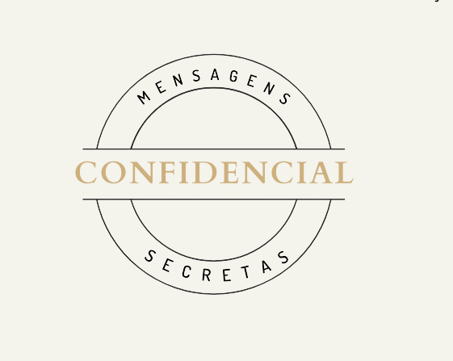
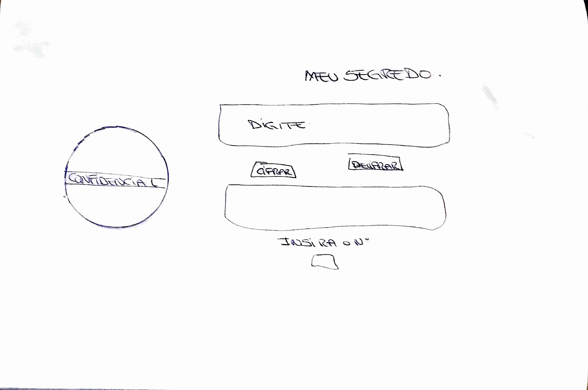
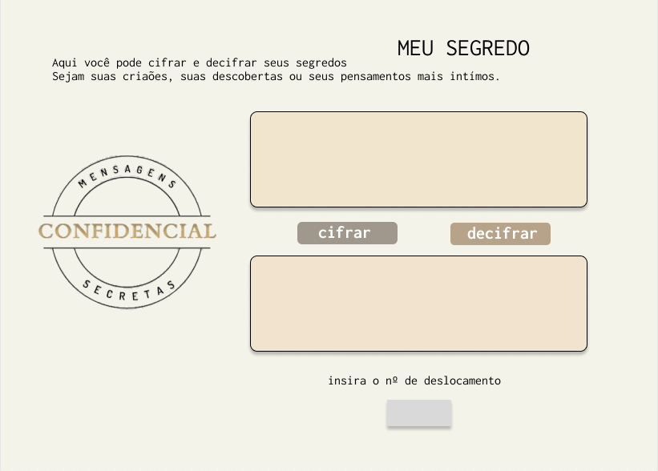

Acesse o deploy [aqui!](https://canzua.github.io/SAP008-cipher/)

##

##

#Projeto Cipher
##(Cifra de César)

1. **Resumo do Projeto**

Objetivo: Desenvolver uma aplicação web, onde o usuário poderá cifrar e decifrar um texto indicando a chave de deslocamento (offset).

Tema: O tema escolhido foi - Meu Segredo - onde desenvolvi uma aplicação que permite ao usuário cifrar seus segredos intimos e guardar de forma segura.

- Quem são os principais usuário do produto? 
Qualquer pessoa que queira cifrar ou decifrar textos para maior segurança da informação

- Quais são os objetivos do usuário em relação com o produto? 
Cifrar segredos que considera importantes e não quer que sejam descobertos.

- Como você acredita que o produto está resolvendo os problemas do usuário? 
Criptografrando informações importantes para que sejam guardadas de forma segura.

2. **Considerações Técnicas**

    VS code (codificação)
    Figma (prototipo)
    Trello (Kanban | Planejamento)
    Canva (logo)

Linguagens: JavaScript | HTML5 | CSS3

3. **Processo do Desenvolvimento do Produto**

    * Escolha do tema
    * Levantamento de problemas
    * Levantamento de informações e dados sobre o problema escolhido
    * Planejamento
    * Definição de público alvo
    * Protótipo do projeto (baixa e alta)
    * Criação de Logo
    * Codificação
    * Teste de usabilidade
    * Deploy - Git Pages

4. **Futuras Implantações**

    * Reconhecer espaços
    * Aceitar números e caracteres especiais
    * Compartilhar o evento
    * Verificação de email
    
5. **Desenvolvido por 
